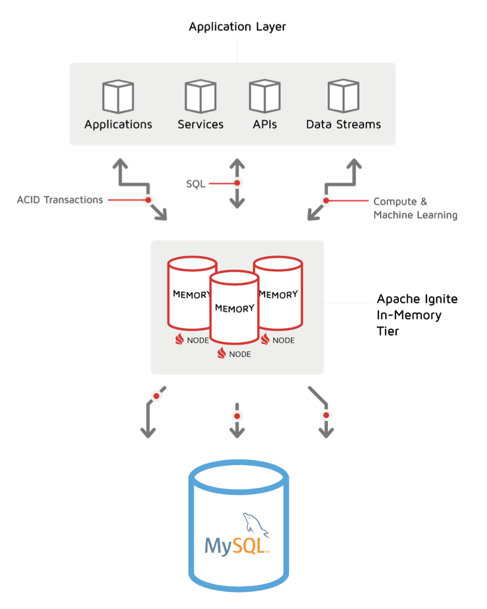
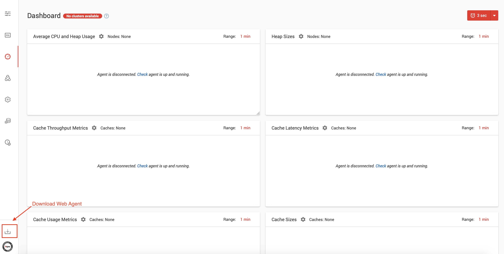
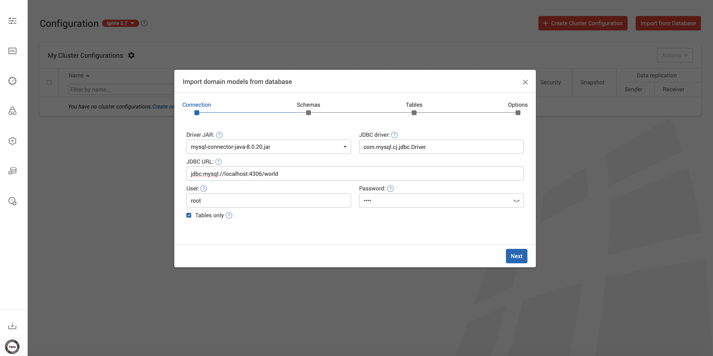
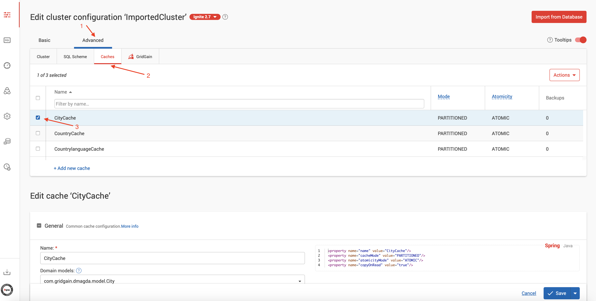
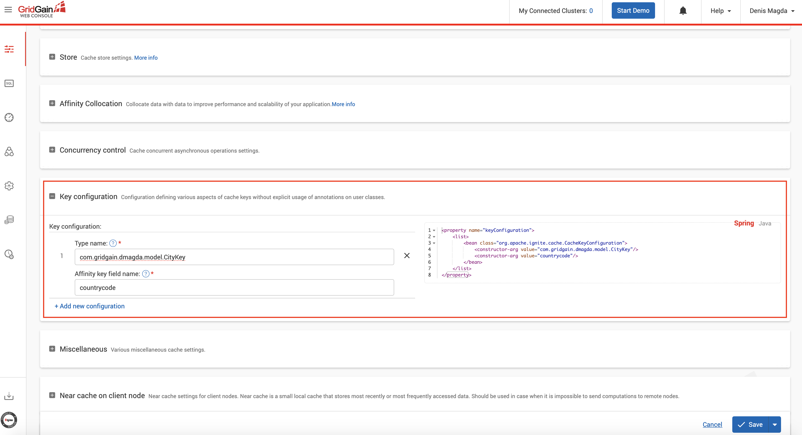
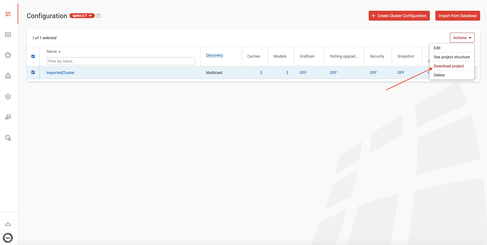
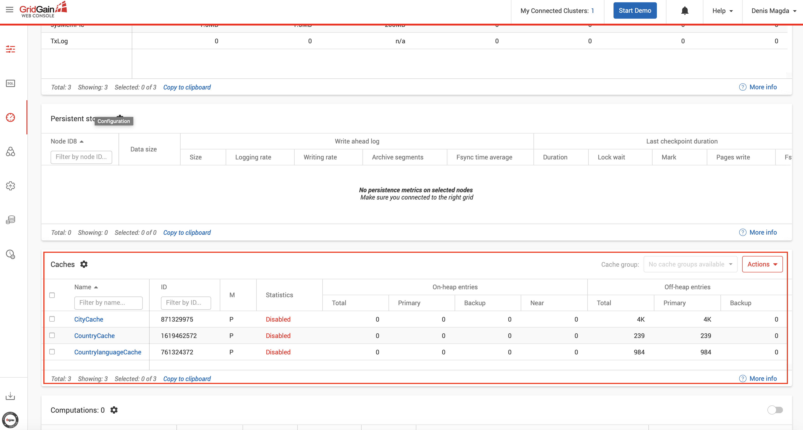
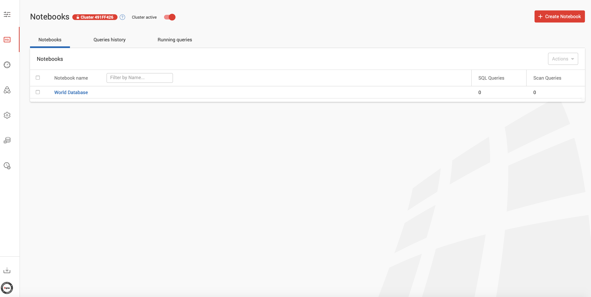

# Demo: MySQL Caching and Acceleration With Apache Ignite

The demo shows how to deploy an Apache Ignite cluster on top of a MySQL database to accelerate the latter.

<div style="text-align: center;">
    
</div>
 
In particular, you will learn to do the following:
* Prepare an Ignite configuration from a MySQL database using GridGain WebConsole.
* Run several nodes Ignite cluster and load it with the records from MySQL.
* Run SQL queries in Ignite, including queries with distributed joins.
* Update data in Ignite and get changes automatically synchronized to MySQL.

## Deploying MySQL and GridGain WebConsole

Start MySQL and GridGain WebConsole as separate Docker containers by running this bash script:

`./start.sh`

(Note, edit `demo-docker-compose.yml` if any container fails to start due to already occupied ports on the host end)

Create an account with GridGain WebConsole by going to the following URL from your browser:

http://localhost:9090/signup

Next, go to WebConsole Dashboard (http://localhost:9090/monitoring/dashboard) and download Web Agent:



Navigate to the root directory of Web Agent, open `default.properties` file and edit `server-uri` parameter:

`server-uri=http://localhost:9090`

## Download and Install MySQL JDBC Driver

You're going to use GridGain WebConsole's configuration wizard to prepare an Ignite cluster configuration from an 
existing MySQL database. Also, the same driver will be needed for Ignite nodes to communicate with the database.

Download `JDBC Driver for MySQL (Connector/J)` from an official source: https://www.mysql.com/products/connector/

Copy the driver's JAR file to `gridgain-web-agent-root/jdbc-drivers` folder.

## Prepare Ignite Cluster Configuration and Sample Project

Go to `gridgain-web-agent-root/` folder and start Web Agent:

`./web-console-agent.sh`

Open Web Console's configuration wizard (http://localhost:9090/configuration/overview), click on `Import From Database`
button and fill in the screen with the parameters as on the picture below:


* JDBC URL: `jdbc:mysql://localhost:4306/world`
* User: `root`
* Password: `root`

Next, click through the wizard's dialog applying default settings and finish the configuration creation process by clicking 
on `Save` button on the final screen.

Select the configuration and go to the `Advanced->Caches` settings tab:



Scroll down and set `countrycode` field of `com.gridgain.dmagda.model.CityKey` class as an affinity key and click on `Save` button:



Finally, download the sample project generated by the configuration wizard as shown on the picture below:



## Start Ignite Cluster and Load Data From MySQL

Open the sample project with your favourite IDE such as IntelliJ IDEA or Eclipse. Locate `META-INF/secret.properties` file
and initialize it with the following settings:

```
dsMySQL_World.jdbc.url=jdbc:mysql://localhost:4306/
dsMySQL_World.jdbc.username=root
dsMySQL_World.jdbc.password=root
```

Start a couple of Ignite server nodes by compiling and executing `ServerNodeCodeStartup` class.

Pre-load the cluster with data from MySQL by executing `LoadCaches` class. 

Once the data is loaded, open Web Console Dashboard (http://localhost:9090/monitoring/dashboard) and confirm you 
can see all the caches are created and keep records:



## Run SQL Queries Against Ignite Cluster

Open Web Console SQL Notebooks screen (http://localhost:9090/queries/notebooks) and create a notebook named `World Database`:



Execute the following two queries over the cached data to demonstrate how to run simple queries as well as queries with
distributed JOINs:

* Top 3 most populated cities:
`SELECT name, MAX(population) as max_pop FROM "CountryCache".country GROUP BY name, population ORDER BY max_pop DESC LIMIT 3;`

* Most inhabited cities across some countries:
```
SELECT country.name, city.name, MAX(city.population) as max_pop FROM "CountryCache".country as country JOIN "CityCache".city as city
ON city.countrycode = country.code
WHERE country.code IN ('USA','RUS','CHN','KOR','MEX','AUT','BRA','ESP','JPN') GROUP BY country.name, city.name 
ORDER BY max_pop DESC LIMIT 3;
```

## Update Data in Ignite and Get Changes Synchronized to MySQL

Connect to MySQL using `root` as a user and password:

```
docker exec -it mysql /bin/bash
mysql -u root -p world
```

Execute the following command and remember the name of the city and its population the command returns:
```
select * from city where id = 315;
+-----+---------+-------------+-----------+------------+
| ID  | Name    | CountryCode | District  | Population |
+-----+---------+-------------+-----------+------------+
| 315 | Mar?lia | BRA         | S?o Paulo |     188691 |
+-----+---------+-------------+-----------+------------+
1 row in set (0.00 sec)
```

Run the same query in Ignite using Web Console (add `CityCache` as a schema name):
`select * from "CityCache".city where id = 315;`

The query will return the same data confirming that both Ignite and MySQL stay in sync.

Now, change the value of the `population` field by this `UPDATE` operation in Ignite:
`update "CityCache".city set population = 5000 where id = 315;`

Finally, select the city record with id `315` again in Ignite and MySQL to see that the value of `population` was 
updated across memory and disk tiers. That's how Ignite writes-through all the changes to underlying database!

## Stop Demo

Stop the demo, terminating all the containers by running the following script:
`sudo ./stop.sh`

Don't forget to halt the Ignite server nodes that were started from the IDE as well as the Web Agent process.
